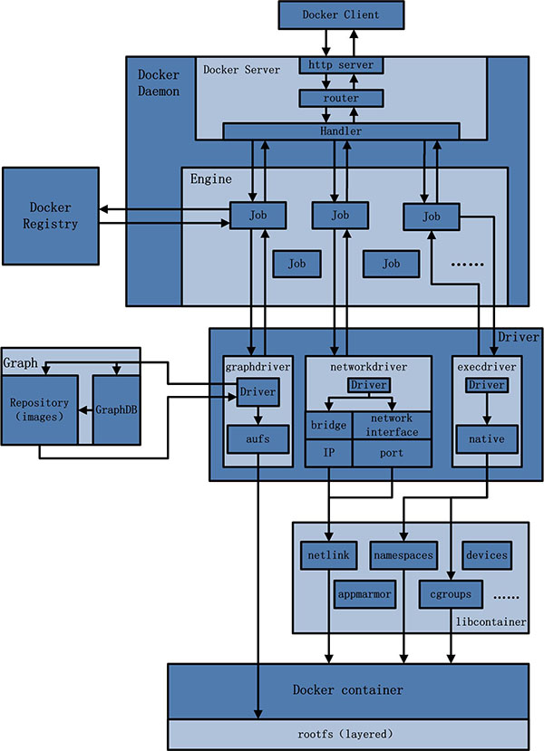

## deamon＊
Docker对使用者来讲是一个```C/S```模式的架构，而Docker的后端是一个非常松耦合的架构，模块各司其职，并有机组合，支撑Docker的运行,如下图所示：



不难看出，用户是使用Docker Client与Docker Daemon建立通信，并发送请求给后者。
而Docker Daemon作为Docker架构中的主体部分，首先提供Server的功能使其可以接受Docker Client的请求；而后Engine执行Docker内部的一系列工作，每一项工作都是以一个Job的形式的存在。

Job的运行过程中，当需要容器镜像时，则从Docker Registry中下载镜像，并通过镜像管理驱动graphdriver将下载镜像以Graph的形式存储；当需要为Docker创建网络环境时，通过网络管理驱动networkdriver创建并配置Docker容器网络环境；当需要限制Docker容器运行资源或执行用户指令等操作时，则通过execdriver来完成。

而libcontainer是一项独立的容器管理包，networkdriver以及execdriver都是通过libcontainer来实现具体对容器进行的操作。

当执行完运行容器的命令后，一个实际的Docker容器就处于运行状态，该容器拥有独立的文件系统，独立并且安全的运行环境等。

####Docker Client

Docker Client是Docker架构中用户用来和Docker Daemon建立通信的客户端。用户使用的可执行文件为docker，通过docker命令行工具可以发起众多管理container的请求。

Docker Client可以通过以下三种方式和Docker Daemon建立通信：tcp://host:port，unix://path_to_socket和fd://socketfd。为了简单起见，本文一律使用第一种方式作为讲述两者通信的原型。与此同时，与Docker Daemon建立连接并传输请求的时候，Docker Client可以通过设置命令行flag参数的形式设置安全传输层协议(TLS)的有关参数，保证传输的安全性。

Docker Client发送容器管理请求后，由Docker Daemon接受并处理请求，当Docker Client接收到返回的请求相应并简单处理后，Docker Client一次完整的生命周期就结束了。当需要继续发送容器管理请求时，用户必须再次通过docker可执行文件创建Docker Client。

####Docker Daemon

Docker Daemon是Docker架构中一个常驻在后台的系统进程，功能是：接受并处理Docker Client发送的请求。该守护进程在后台启动了一个Server，Server负责接受Docker Client发送的请求；接受请求后，Server通过路由与分发调度，找到相应的Handler来执行请求。

Docker Daemon启动所使用的可执行文件也为docker，与Docker Client启动所使用的可执行文件docker相同。在docker命令执行时，通过传入的参数来判别Docker Daemon与Docker Client。

deamon的参数选项：

	Usage: docker daemon [OPTIONS]
	A self-sufficient runtime for linux containers.
	Options:
	  --api-cors-header=""                   Set CORS headers in the remote API
	  -b, --bridge=""                        Attach containers to a network bridge
	  --bip=""                               Specify network bridge IP
	  -D, --debug=false                      Enable debug mode
	  --default-gateway=""                   Container default gateway IPv4 address
	  --default-gateway-v6=""                Container default gateway IPv6 address
	  --dns=[]                               DNS server to use
	  --dns-search=[]                        DNS search domains to use
	  --default-ulimit=[]                    Set default ulimit settings for containers
	  -e, --exec-driver="native"             Exec driver to use
	  --exec-opt=[]                          Set exec driver options
	  --exec-root="/var/run/docker"          Root of the Docker execdriver
	  --fixed-cidr=""                        IPv4 subnet for fixed IPs
	  --fixed-cidr-v6=""                     IPv6 subnet for fixed IPs
	  -G, --group="docker"                   Group for the unix socket
	  -g, --graph="/var/lib/docker"          Root of the Docker runtime
	  -H, --host=[]                          Daemon socket(s) to connect to
	  -h, --help=false                       Print usage
	  --icc=true                             Enable inter-container communication
	  --insecure-registry=[]                 Enable insecure registry communication
	  --ip=0.0.0.0                           Default IP when binding container ports
	  --ip-forward=true                      Enable net.ipv4.ip_forward
	  --ip-masq=true                         Enable IP masquerading
	  --iptables=true                        Enable addition of iptables rules
	  --ipv6=false                           Enable IPv6 networking
	  -l, --log-level="info"                 Set the logging level
	  --label=[]                             Set key=value labels to the daemon
	  --log-driver="json-file"               Default driver for container logs
	  --log-opt=[]                           Log driver specific options
	  --mtu=0                                Set the containers network MTU
	  -p, --pidfile="/var/run/docker.pid"    Path to use for daemon PID file
	  --registry-mirror=[]                   Preferred Docker registry mirror
	  -s, --storage-driver=""                Storage driver to use
	  --selinux-enabled=false                Enable selinux support
	  --storage-opt=[]                       Set storage driver options
	  --tls=false                            Use TLS; implied by --tlsverify
	  --tlscacert="~/.docker/ca.pem"         Trust certs signed only by this CA
	  --tlscert="~/.docker/cert.pem"         Path to TLS certificate file
	  --tlskey="~/.docker/key.pem"           Path to TLS key file
	  --tlsverify=false                      Use TLS and verify the remote
	  --userland-proxy=true                  Use userland proxy for loopback traffic

如果你想要运行守护态进程，你可以输入  ```docker -d```（之前版本是  ```docker deamon```）。如果想加入Debug模式，输入```docker -d -D ```即可。

* Deamon socket 选项

Docker deamon 通过三种不同的socket方式监听```docker remote API```请求，分别是：```unix、tcp、以及fd。```

默认情况下，通过创建在```/var/run/docer.sock```文件内的```unix domain socket```（或者 IPC socket）来接收root或者docker用户组的请求。如果你想远程通信你需要打开tcpSocket。

要注意的是，默认的方式提供了一个未加密未验证直接连接deamon。应该使用内置的HTTPS加密的socket或者在前面使用一个安全的web代理。使用-H ```tcp://0.0.0.0:2375```来监听所有ip地址接口的2375端口，或者指定一个主机IP监听```-H 192.168.2.160:2375```。通常情况下2375端口是 未加密的，而2376用于与deamon通信的加密端口。

	注意：如果你使用HTTPS加密socket ，目前支持TLS1.0或更高级的协议，不支持Protocols SSLv3或者低于此版本的协议。

在Systemd基础的系统中，使用```docker -d -H fd://```,通过Systemd socket activation与deamon通信。对于大多数设置，使用fd://将很好的运作，你也可以指定单个socket：```docker -d -H fd://3```。如果没有找到指定的激活的文件，Docker 将会退出进程。

1. **Server端**

    -H参数可以多次指定监听不同的端口：

    例如指定监听主机默认的unix socket以及指定的IP地址：

	    $ sudo docker -d -H unix:///var/run/docker.sock  -H tcp://192.168.2.160:2375

2. **Client端**

    为客户端设置-H参数，将使客户端监听```DOCKER_HOST```环境变量指定的参数：

	    $ docker -H tcp://0.0.0.0:2375 ps
    或者
	
        $ export DOCKER_HOST="tcp://0.0.0.0:2375"
	    $ docker ps

    设置 ```DOCKER_TLS_VERIFY```环境变量相当于设置```--tlsverify```参数：

	    $ docker --tlsverify ps
    或者

	    $ export DOCKER_TLS_VERIFY=1
	    $ docker ps

    以上设置是等效的

    Docker客户端会遵守```HTTP_PROXY,HTTPS_PROXY以及NO_PROXY```这三个环境变量运行。其中```HTTPS_PROXY```优先权大于```HTTP_PROXY```


* storage-driver 选项

	Docker deamon 支持许多不同的镜像层存储驱动：aufs、devicemapper、btrfs、zfs以及overlay。

	1. aufs是最老的，但是由于它是基于linux 内核patch-set,不太可能被合并到主内核中。这也会导致一些严重的系统崩溃。但是，aufs也是唯一允许容器共享可执行文件以及共享类库内存的存储驱动，所以对于那些需要运行数以千计运行相同程序或类库的容器会非常有用。

	2. devicemapper使用自动精简配置以及Copy on Write(COW)快照。对于每一个graph位置通常是在/var/lib/docker/devicemapper中，通常被分为两块设备，一块给数据，一块给metadata。默认的，这些块设备是通过使用自动创建的零散文件回送挂载来自动创建的。Refer to Storage driver options below for a way how to customize this setup.~jpetazzo/Resizing Docker containers with the Device Mapper plugin article explains how to tune your existing setup without the use of options.

	3. Btrfs 对于docker build构建镜像时会非常快，但是和devicemapper一样不会共享可执行文件以及类库的内存。使用方法：
	
            docker -d -s btrfs -g /mnt/btrfs_partition

	4. Zfs 没有btrfs那么快，但是对相对较长记录有更稳定地支持。由于克隆之间的单一副本ARC共享块将被一次缓存，使用方法：
	
            docker -d -s zfs

    Use docker daemon -s zfs. To select a different zfs filesystem set zfs.fsname option as described in Storage driver options.

	5. Overlay 是一个非常快的联合文件系统，它现在被并入了3.18.0的Linux内核中，使用方法：
	
            docker -d -s overlay


* storage-opt选项

    ***```dm.thinpooldev```***,指定块存储设备所使用的thin pool。

	    docker -d --storage-opt dm.thinpooldev=/dev/mapper/thin-pool

    ***```dm.basesize```*** 指定基础存储大小，同时限制镜像以及容器。默认值时100G。
修改此值需要执行以下操作才生效：

    	$ sudo service docker stop
    	$ sudo rm -rf /var/lib/docker
    	$ sudo service docker start

    使用方法：

	    $ docker -d --storage-opt dm.basesize=20G

    ***```dm.loopdatasize```*** 这个选项配置devicemapper looback，这不应该在生产中使用。默认值是100G，用于设定thin pool为数据产生的回送的零散文件存储大小，通常不会占用那么多空间。

    使用方法：

	    $ docker -d --storage-opt dm.loopdatasize=200G

    ***```dm.loopmetadatasize```*** 与上面类似，只是设定元数据存储大小。

    使用方法

	    $ docker -d --storage-opt dm.loopmetadatasize=4G

    ***```dm.fs```*** 设定文件系统基础设备类型，支持的类型是ext4和xfs，默认是ext4

    使用方法：

	$ docker -d --storage-opt dm.fs=xfs

    ***```dm.mkfsarg```*** 设定在创建基础设备时mkfs所用到的参数

    使用方法：

    	$ docker -d --storage-opt "dm.mkfsarg=-O ^has_journal"

    ***```dm.mountopt```*** 挂载设备时设置挂载选项。

    使用方法：

    	$ docker -d --storage-opt dm.mountopt=nodiscard

    ***```dm.blocksize```*** 为thin pool 设置块大小。默认是64K

    使用方法：

	$ docker -d --storage-opt dm.blocksize=512K

    ***```dm.blkdiscard```*** 当删除devicemapper设备时允许或禁止使用blkdiscard 默认是允许（enable）。如果禁止，将会时删除容器更加快速，但是不会返回其中文件的使用空间。

    使用说明：

    	$ docker -d --storage-opt dm.blkdiscard=false

    ***```dm.override_udev_sync_check```*** 设置该参数为true，可以协调devicemapper 与 udev的资源利用。当其设置为false时，将会在devicemapper与udev产生竞争，有可能导致错误或者失败。

    使用方法：

    	$ docker -d --storage-opt dm.override_udev_sync_check=true

* Docker execdriver选项

    目前zfs支持的选项```zfs.fsname```

    使用方法：

    	$ docker daemon -s zfs --storage-opt zfs.fsname=zroot/docker

    另外，可以使用 ```-e lxc``` 来启用```lxcexecution``` 设备

* Daemon DNS选项

    设置dns 服务器

    	$  docker -d --dns 8.8.8.8
    	$  docker -d --dns-search example.com

* 不安全仓库登记

    一个安全的私有仓库通过使用TLS和CA证书的副本来替换```/etc/docker/certs.d/myregistry:5000/ca.crt```文件。不使用TLS，或者使用未知CA证书的TLS都将是不安全的。如果CA证书验证实效或者在```/etc/docker/certs.d/myregistry:5000/```找不到证书将会报错。使用```--insecure-registry```参数可以标记一个不安全的仓库：

    	--insecure-registry myregistry:5000
将告诉 deamon 这个```myregistry:5000```仓库应该标记为不安全状态。

    	--insecure-registry 10.1.0.0/16
告诉deamon通过CIDR语法解析出来的IP地址是```10.1.0.0/16```的仓库标记为不安全。

    如果没有使用参数```--insecure-registry```标记，那么```docker pull 、docker push、docker search``` 从指定仓库执行时将会报错。
